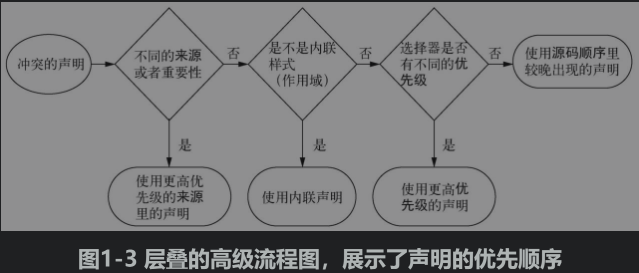

#### 主要内容
* 组成层叠的四个部分
* 层叠和继承的区别
* 如何控制样式和元素的对应关系
* 简写声明的常见误区

----

#### CSS
> cascade 

如果发现一个规则没有按照预期生效，那么可能是因为和另外一条规则冲突了，要想理解预测规则的最终效果，那么就需要理解CSS 中的叠层

同一个元素的样式可以由多种方式决定，class、id、元素选择器等三种方式
并且可以同时定义好几个类

CSS 定义的，id 选择器为第一优先级响应的；

当出现冲突的时候，CSS 会依据三条线索来解决冲突
1. 样式表的来源：样式是从哪里来的，包括你的样式和浏览器默认样式等
2. 选择器优先级：那些选择器会比另外一些选择更总要
3. 源码顺序，样式在样式表中的什么顺序

> 应该避免尽量使用 id 选择器
> 因为它是最高优先级的选择器，后续再写选择就不能覆盖他了

样式后面标记 `!important` 会被认为是更高优先级的来源

##### 浏览器将优先级分为 HTML 行内样式和选择器样式

> 行内样式：

就是在 HTML 中使用属性`style` 属性定义样式，是个带作用域的声明，只能使用在当前的元素上，**它会覆盖任何来自样式的样式**

类选择器优先级比id 选择器低，优先级的规则如下
1. 选择器的 id 数量个更多，则会胜出
2. 如果 id 数量一致，那么拥有最多类的选择胜出
3. 如果以上2此比较都一样，那么拥有最多标签名字的选择器胜出

014.html 中的列子

伪类选择器和属性选择器和类选择器的优先级是相同的，通用选择器 * 对优先级没有影响。

如果声明的来源和优先级相同，但是其中的一个声明在样式表中出现的较晚，或者位于页面较晚引入的样式表中，则该声明优先级高。 016.html

在CSS 中实现相同的效果会有多种方式，所以通常一个问题的答案通常会是 **这得看情况**，多想实现方法，并且思考每一种方法的利弊。

面对同一个问题作者通常使用2中方式解决
1. 首先确定哪些声明可以实现效果
2. 可以用那些选择器结构

浏览器遵循三个步骤解析元素的样式
1. 来源：style属性 还是外来定义的样式
2. 优先级
3. 顺序

##### 2 条经验法则
1. 选择器使用中不使用 id，对后续修改覆盖难度加大
2. 不使用  !important 它比 id 更难覆盖，如果要覆盖，那么就需要都加一个  !important