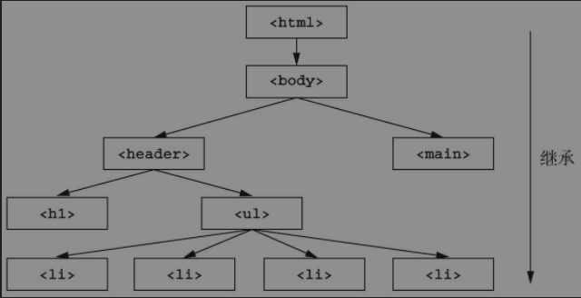
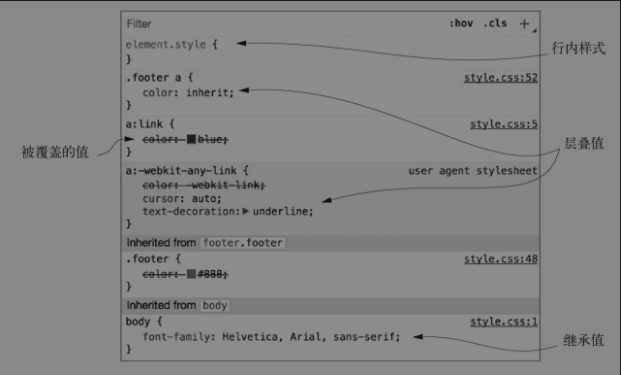

如果一个属性没有叠加层，那么则可能会继承某个祖先元素的值。

也不是所有的属性都能给个被继承，默认只有特定的属性被继承
它们主要是跟文本相关的属性：color、font、font-family、font-size、font-weight、font-variant、font-style、line-height、letter-spacing、text-align、text-indent、text-transform、white-space以及word-spacing。

可以在适当的场景使用继承。比如给body元素应用字体，让后代元素继承该字体

浏览器中查看元素的样式继承情况

在选择器下方是继承属性。元素所有的层叠和继承一目了然。

----
#### 元素样式的简写形式
border是border-width、border-style以及border-color的简写属性
以及 margin是margin-left/margin-right/margin-top/margin-bottom 的简写。

大多数简写属性可以省略一些值，只指定我们关注的值。但是要知道，这样做仍然会设置省略的值，即它们会被隐式地设置为初始值。这会默默覆盖在其他地方定义的样式。018.html

像margin、padding这样的属性，还有为元素的四条边分别指定值的边框属性时，开发者容易弄错这些简写属性的顺序。这些属性的值是按顺时针方向

**如果声明结束时四个属性值还剩一个没指定，没有指定的一边会取其对边的值。指定三个值时，左边和右边都会使用第二个值。指定两个值时，上边和下边会使用第一个值。如果只指定一个值，那么四个方向都会使用这个值。因此下面的声明都是等价的。**
> 如果声明结束时四个属性值还剩一个没指定，没有指定的一边会取其对边的值。指定三个值时，左边和右边都会使用第二个值。指定两个值时，上边和下边会使用第一个值。如果只指定一个值，那么四个方向都会使用这个值。因此下面的声明都是等价的。